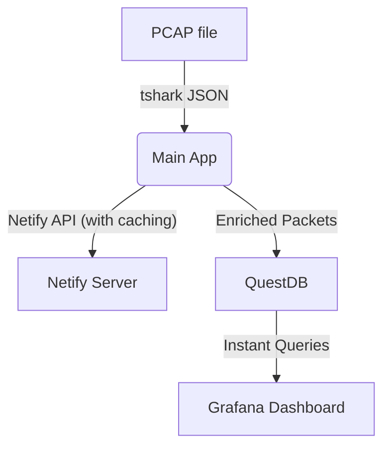

# MT_ProcessPKTs

**MT_ProcessPKTs** is a command-line Go application and data pipeline for processing network packet
capture (PCAP) files, enriching the extracted data with [Netify](https://www.netify.ai/) application
and geolocation metadata, and efficiently storing everything in [QuestDB](https://questdb.io/) for
scalable analytics. It is also ready for visualization in [Grafana](https://grafana.com/) with a
provided dashboard template.


- **PCAP Parsing**: Parses packet-level data from PCAP files using `tshark`.
- **Enrichment via Netify**: Looks up application, category, and detailed geolocation data via the
  Netify API for IPs and TLS Server Name Indication (SNI) domains.
- **Smart Caching**: Implements an internal caching layer, minimizing Netify API requests and optimizing
  throughput, with persistent cache to disk.
- **Time Series Storage**: Writes all enriched results efficiently into QuestDB with proper schema,
  indexes, and partitioning for fast analytics.
- **Pre-baked Dashboards**: Ships with a curated [Grafana dashboard](Grafana_Dashboard.json) for
  instant visualization of flows, geo breakdowns, application analysis, frequency distributions, and
  more.
- **Composable with Docker**: Comes with a [`compose.yml`](compose.yml) for convenient launch of
  QuestDB, Grafana, and related resources.
- **Extensible**: Modular Go codebase, easy to adapt to new enrichment sources or analytics
  backends.

---

## Usage

### Prerequisites

- **Go 1.25+**
- `tshark` (part of Wireshark) must be installed and available in your `$PATH`.
- A [Netify Data Feed API key](https://www.netify.ai/products/netify-data-feeds/pricing).
- Running local QuestDB instance (can be orchestrated via the provided `compose.yml`).

### Getting Started

1. **Clone and build:**
   ```bash
   git clone https://github.com/olegbilovus/MT_ProcessPKTs.git
   cd MT_ProcessPKTs
   go build -o mt_processpkts ./cmd/MT_ProcessPKTs
   ```

2. **Run with your data:**
   ```bash
   ./mt_processpkts \
     -pcap mycapture.pcap \
     -netify-apikey <YOUR_NETIFY_API_KEY>
   ```

   **Flags:**
    - `-pcap`: Path to the PCAP file (default: `capture.pcap`)
    - `-tshark-json-cache-dir`: Where to cache tshark's JSON output (default: `tshark_json_cache`)
    - `-filter`: Display filter for tshark (optional)
    - `-name`: Name for the experiment/table in QuestDB (optional)
    - `-netify-apikey`: **REQUIRED** Netify API key
    - `-netify-cache-port`: Port for the Netify cache server (default: random)
    - `-netify-cache-dir`: Persistent directory for Netify API responses (default: `netify_cache`)

3. **Explore in Grafana:**
    - Use Docker Compose to launch full [Grafana + QuestDB stack](compose.yml).
    - Import [Grafana_Dashboard.json](Grafana_Dashboard.json) for pre-made visualizations.

---

## Output Table Schema

Packets and enrichment are stored in a table named `packets_<experiment>` in QuestDB. Main fields
include:

| Field                            | Type      | Description                                  |
|----------------------------------|-----------|----------------------------------------------|
| ts                               | TIMESTAMP | Capture timestamp                            |
| ip_src, ip_dst                   | IPV4      | Source and destination IP addresses          |
| ip_src_type, ip_dst_type         | SYMBOL    | LOCAL/PUBLIC                                 |
| port_src, port_dst               | INT       | Source/destination ports                     |
| frame_len, stream_index          | SHORT,INT | Packet/frame length, stream index            |
| ip_proto                         | SYMBOL    | Protocol (TCP/UDP/etc.)                      |
| tls_sni, tls_alpn                | SYMBOL    | TLS SNI (domain), Application-Layer Protocol |
| ip_*_netify_* / tls_sni_netify_* | SYMBOL    | Application/geolocation enrichment tags      |

(See [internal/questdb/questdb.go](internal/questdb/questdb.go) for full schema.)

---

## Data flow



---

## Dashboards & Analytics

- Import the [Grafana_Dashboard.json](Grafana_Dashboard.json) file into your Grafana instance.
- Includes dynamic panels for:
    - Protocol, application, and geo breakdowns
    - SNI and domain analytics
    - Time series graphs
    - Interactive exploration by experiment/table

---

## License

MIT License — see [LICENSE](LICENSE).
